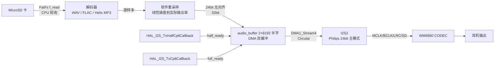

# 🎵 STM32 Music Player — F407ZGT6 版

基于 **STM32F407ZGT6** 的实时嵌入式音乐播放器 —— 从 MicroSD 卡读取音频文件，片上解码 **WAV / FLAC / MP3**，经 **I2S** 输出至 **WM8960** codec 的耳机输出。

<p align="center">
  
  
  
  
  
  
  
  
</p>

> 📌 这是 **F407ZGT6 版**（当前 `main` 分支）。旧的 **F103ZET6 版**见分支 **`V0.0-F103Ver`**。

---

## ✨ 项目简介

本项目运行在 **STM32F407ZGT6**（168MHz / 128KB SRAM + 64KB CCM / 1MB Flash）上，用 FreeRTOS 多任务实现完整的
**"SD 卡 → FATFS → 解码 → 软件重采样 → DMA 双缓冲 → I2S → WM8960 → 耳机输出"** 数据通路。

从 F103 版移植而来，并在此基础上把三种格式全部打通：**WAV / FLAC / MP3 均能完整正确播放**，
解决了切歌瞬态噪声、按键误触发、SD 卡热插拔等问题，**v1.0 完成**（详见 [v1.0 更新内容](#-v10-更新内容重点)）。

---

## 🚀 功能特性

| 功能 | 状态 | 说明 |
|:---|:---:|:---|
| WAV 播放 | ✅ 已完成 | 8 / 16 / 24 / 32bit，单声道 / 立体声，按 WAV 头动态配置 |
| FLAC 解码 | ✅ 已完成 | 自写精简解码器（block ≤ 4608），已逐样本 bit-exact 验证 |
| MP3 解码 | ✅ 已完成 | **Helix 定点解码器**（纯整数，避开 ARM 上浮点解码器的坑） |
| 动态采样率 | ✅ 已完成 | PLLI2S 精确生成 44.1k / 48k 等；软件线性插值重采样保证音高与时长正确 |
| 上一首 / 下一首 | ✅ 已实现 | PF0 / PF1（长按＝快退 / 快进） |
| 播放 / 暂停 | ✅ 已实现 | PF2 |
| 停止 | ✅ 已实现 | PF5（菜单键，当前暂作停止） |
| 音量控制 | ✅ 已实现 | PF7 / PF8，WM8960 硬件音量 0~100 档，支持按住连调 |
| OLED 显示 | ✅ 已实现 | 歌名滚动 / 采样率 / 声道 / 位深 / 播放状态 / 音量 |
| 多语言文字库 | ✅ 已实现 | 点阵字库存 **W25Q64**，支持 **简中/繁中/日/英/韩/俄**；SD 卡放 `font16.bin` 开机自动烧入 |
| USB Mass Storage | ✅ 已实现 | 插电脑可当读卡器，此时自动暂停播放并让出 SD 卡 |
| SD 卡热插拔 | ✅ 已实现 | 拔卡立即提示，插回自动重新挂载并重新扫描 |
| 外部 DAC 试听口 | ✅ 板上预留 | 另有独立 I2S 排针，可外接 PCM5102a 等做对比试听 |
| USB 声卡 (UAC) | 🔜 规划中 | — |

---

## 🛠 硬件连接

### 引脚分配

| 外设 | 引脚 | 功能 |
|:---|:---|:---|
| **I2S2** | PC6 | MCK（主时钟，256 × fs） |
| | PB10 | CK（位时钟 BCLK） |
| | PB12 | WS（帧同步 LRC） |
| | PC3 | SD（数据输出） |
| **WM8960 控制** | PB6 | SCL（I2C1，与 OLED 共总线，7 位地址 0x1A） |
| | PB7 | SDA |
| **OLED (I2C1)** | PB6 / PB7 | 128×64，地址 0x78，400kHz |
| **SDIO** | PC8~PC11 | D0~D3（4-bit） |
| | PC12 | CK |
| | PD2 | CMD |
| **按键** | PF0 / PF1 | 上一首 / 下一首（EXTI，长按快退 / 快进） |
| | PF2 | 播放 / 暂停（EXTI） |
| | PF5 | 菜单键（当前暂作"停止"，EXTI，双沿） |
| | PF7 / PF8 | 音量 + / −（普通输入，任务轮询） |
| | PF3 / PF4 / PF6 | 预留（菜单上下 / 返回） |
| **W25Q64** | PA4 | SPI1 片选 |
| **USB** | PA11 / PA12 | OTG FS（DM / DP），作 MSC 读卡器 |

> **CODEC**：WM8960（I2C 寄存器控制型，24bit I2S 从模式，耳机输出）。
> 注意它是**寄存器配置型**器件，上电默认 DAC / 输出驱动 / 混音器 / 音量几乎全关，必须由 MCU 写初始化序列才有声。
> 板上另有 **独立 I2S 排针**，可外接 PCM5102a 这类硬件配置型 DAC 做 A/B 对比。
>
> 📐 **本板的完整硬件资料**（立创EDA 工程 / GERBER / BOM / 原理图）都在本仓库 [`Hardware/`](Hardware) 目录下。

### 时钟树

```
HSE 8MHz ──┬── PLL (M=8, N=336, P=2) ──> SYSCLK 168MHz
           │                              ├── AHB / APB ──> SDIO(48MHz), DMA, GPIO, I2C
           │                              └── USB (Q=7) ──> 48MHz
           └── PLLI2S (N/R 动态搜索) ──> I2S2 时钟 ──> MCLK = 256 × fs，fs 精确到 44.1k / 48k
```

---

## 🧠 软件架构

### RTOS 任务（FreeRTOS / CMSIS-RTOS v2）

```
┌──────────────────────────────────────────────────────────────────────┐
│                          FreeRTOS 调度器                              │
│                                                                       │
│  ┌────────────────┐   ┌────────────────────┐   ┌──────────────────┐  │
│  │ defaultTask    │   │   AUDIO_READ       │   │   FILE_LOAD      │  │
│  │ prio Normal2   │   │   prio Normal      │   │   prio Normal1   │  │
│  │ 栈 512B        │   │   栈 8KB           │   │   栈 3KB         │  │
│  │ USB 初始化/监听 │   │   播放主控          │   │   扫描 SD 文件    │  │
│  └────────────────┘   └─────────┬──────────┘   └────────┬─────────┘  │
│                                 │  LOAD_DONE_OR_NOT      │            │
│                                 │◄──── 信号量 ───────────┘            │
│                                 │  LOAD_OR_NOT                        │
│                                 └──────── 循环 ─────────────────────►  │
└──────────────────────────────────────────────────────────────────────┘
        + 软件定时器(50ms)：OLED 歌名滚动 / 切歌键长按判定 / 音量键轮询
```

### 音频数据通路



### 播放核心机制

- **DMA 双缓冲**：`audio_buffer` 为 2 行 × 8192 半字（每行 2304 帧，@48k 约 48ms 窗口）。
  `HAL_I2S_Transmit_DMA` 在 24bit/32bit 模式下会自动把传输长度翻倍（`Size << 1`），恰好搬完两行，
  配合 DMA 循环模式实现无缝播放。行长度对齐到 FLAC block(4608) 的因数，消除"跨 block 行"的解码尖峰叠加。
- **中断驱动填充**：半传输完成 → 重填后半区；全传输完成 → 重填前半区；`AUDIO_READ` 任务只在两个半区都满时 `osDelay(1)`。
- **软件重采样**：硬件采样率是离散档位（PLLI2S 搜索 N/R 精确生成），源文件可能是 44.1k / 48k，
  用定点相位线性插值把源样本流映射到实际输出率，恢复正确音高与时长。
- **内存复用**：WAV 重采样缓冲 / FLAC 解码器 / Helix 解码器状态三者用 `union` **互斥复用**同一块 CCM 内存 →
  Helix 状态不占额外 SRAM；也因此音频任务栈从 32KB 降到 8KB、FreeRTOS 堆 48KB→24KB。

---

### 点阵字库（W25Q64 · 简中/繁中/日/英/韩/俄）

字库放在 **W25Q64（8MB SPI Flash）** 里，不占内 flash。关键点是**不要按语言拆成 6 个字库**：
简、繁、日三种汉字在 Unicode 里**共用同一个区段 U+4E00–U+9FFF**，拆开只会大量重复。
所以字库是**一个文件、内部按"连续 Unicode 区段"组织**，查字就是一句算术：

```
偏移 = 区段.data_off + (码点 - 区段.start_cp) × 区段.bpg
```

**没有索引表、不占 MCU RAM**（区段表只有几项，启动时缓存）。取字是三级回退：

| 顺序 | 来源 | 覆盖 |
|---|---|---|
| 1 | 内 flash `OLED_F8x16`（8×16 点阵，1.5KB） | ASCII —— 按 8 像素宽专门设计，比把 TTF 挤进 8px 好看，也永远可用 |
| 2 | **W25Q64 字库** | 西里尔(俄)、假名(日)、谚文(韩)、CJK 汉字(简/繁/日)、CJK 与全角标点 |
| 3 | 内 flash GB2312 表（约 230KB，可关） | 兜底；改 `OLED.c` 里 `OLED_USE_INTERNAL_GB2312=0` 即可省掉这 230KB |
| — | 都没有 | 画 `?` 占位 |

**使用流程（三步）**：

```bash
# 1) 本机生成字库(需 pip install pillow; 字体建议 思源黑体/Noto Sans CJK, SIL OFL 授权可自由分发)
python3 tools/gen_font.py --font NotoSansCJKsc-Regular.otf --out font16.bin
#    不烧板子先看效果:  python3 tools/gen_font.py --font X.otf --preview "音AЖ漢한"
#    只想先验证链路:    python3 tools/gen_font.py --selftest --out font16.bin   (几何图案自检字库)

# 2) 把 font16.bin 放 SD 卡根目录, **开机时按住 PF7(音量+)不放** → 才会走 SD 检查/烧写:
#    校验CRC → 擦写 W25Q64(20~40秒, 有百分比) → 回读校验 → "字库已更新"
#    ★平时开机不碰 SD(启动快): 只从 W25Q64 读已烧好的字库; 与 Flash 内容相同也会跳过不重烧

# 3) 开机自检显示 "字库就绪 / 区段:n / 多语言已启用", 或 "字库未烧入 / 把 font16.bin 放SD卡根目录"
```

体积（16×16，六种文字全含 ≈ **1.01 MB**）：

| 区段 | 码点数 | 大小 |
|---|---|---|
| 拉丁补充/西文标点（8×16） | 96 | 1.5 KB |
| 西里尔（俄） | 256 | 8 KB |
| CJK 标点 | 64 | 2 KB |
| 平假名/片假名（日） | 192 | 6 KB |
| 谚文音节（韩） | 11172 | 349 KB |
| **CJK 汉字（简/繁/日共用）** | 20992 | 656 KB |
| 全角字符 | 240 | 7.5 KB |

> **性能不是问题**：SPI1 跑 42MHz，读一个字形 32 字节约 6µs，而 OLED 整屏刷新走 I2C 要十几毫秒。
> 另带 **96 槽字形 LRU 缓存**（约 3KB RAM），滚动字幕反复画同一批字时**完全不碰 SPI**。

代码分工：`font_format.c` 是**纯逻辑**（解析/查表/缓存，不依赖 HAL，可用 gcc 在 PC 上单元测试：
`gcc -I Core/Inc Core/Src/font_format.c tools/test_font_format.c -o t && ./t font16.bin`）；
`font_store.c` 负责 W25Q64 读写与 SD 卡烧写；`OLED.c` 的字符串显示与滚动缓冲都接在这套引擎上。

## 📁 目录结构

```
Music_player_F407ZGT6/
├── Core/
│   ├── Inc/                    # 头文件
│   │   ├── Music_Driver.h      # 播放接口 / WAV 头结构体 / 音频缓冲定义
│   │   ├── wm8960.h            # WM8960 codec 驱动接口
│   │   ├── flac_decoder.h      # 自写 FLAC 解码器
│   │   ├── mp3dec.h            # Helix MP3 解码器接口
│   │   └── FreeRTOSConfig.h    # FreeRTOS 配置
│   ├── Src/                    # 源文件
│   │   ├── main.c              # 主程序 / 时钟 / WM8960 初始化
│   │   ├── freertos.c          # RTOS 任务 + 滚动定时器(滚动/长按/音量轮询)
│   │   ├── Music_Driver.c      # ★ 播放核心：格式分发 / 重采样 / 播放循环
│   │   ├── wm8960.c            # ★ codec 初始化 / 音量 / 上下电时序
│   │   ├── flac_decoder.c      # FLAC 解码
│   │   ├── i2s.c / dma.c       # I2S2 / DMA 外设配置
│   │   ├── sdio.c              # SDIO 外设配置
│   │   └── OLED.c              # OLED 显示驱动（含 GB2312 汉字/滚动）
│   └── Startup/
├── Drivers/                    # STM32F4 HAL 库 / CMSIS
├── FATFS/                      # FatFs + SD 卡底层驱动(sd_diskio.c / bsp_driver_sd.c)
├── Middlewares/                # FreeRTOS / FatFs / libhelix-mp3
├── USB_DEVICE/                 # USB Mass Storage 设备
├── tools/                      # PC 端工具(不参与编译)
│   ├── gen_font.py             # ★ TTF → 点阵字库 bin(多语言/CRC/自检模式/终端预览)
│   └── test_font_format.c      # 字库逻辑的宿主机单元测试(gcc 编译运行)
├── Hardware/                   # ★ 硬件资料（本板完整设计）
│   ├── 音乐播放器：STM32F407ZGT6-WM8960-工程开发板.eprj2   # 立创EDA(专业版)工程
│   ├── hifimp3播放器GERBER/     # GERBER 打包（主板 / 功放板 / 按键板）
│   ├── hifimp3 BOM/            # BOM 表（xlsx：主板 / 功放板 / 按键板）
│   ├── 图纸/                   # 原理图 PDF（主板 / 功放板 / 按键板）
│   └── 音乐播放器：..._backup/  # EDA 工程自动备份快照（历史版本）
├── Music_Player_F407ZGT6.ioc   # STM32CubeMX 工程文件
├── STM32F407ZGTX_FLASH.ld      # 链接脚本（128KB SRAM + 64KB CCM）
├── fix_fpu.bat                 # 兜底脚本：一键把 Debug makefile 的软浮点改硬浮点
├── README.md
└── 开发记录与避坑.md            # ★ 完整开发与排错记录（踩坑全在这，强烈建议一读）
```

---

## 🔧 编译与烧录

1. 安装 [STM32CubeIDE](https://www.st.com/en/development-tools/stm32cubeide.html)（本工程用 1.16 / CubeMX 6.12 生成）。
2. 打开工程：`File → Open Projects from File System…`，选择本目录。
3. **⚠️ 必须确认浮点 ABI**：`Properties → C/C++ Build → Settings → MCU Settings →`
   **`Floating point ABI = Hardware implementation`**。
   本工程用 hardfp（FreeRTOS 用 ARM_CM4F port，会保存 FPU 上下文），若这里是 `Software implementation`
   会编译报错 `selected FPU does not support instruction`。（要在 GUI 里改才会保存，直接改 makefile 会被 Clean 覆盖；
   实在改不动可用 `fix_fpu.bat` 兜底。）
4. 建议把优化级别设为 `-O2`（默认 `-Os`，解码会慢约 10~20%）。
5. Clean → Build → ST-Link 烧录。
   若烧录失败：给板子**独立供电**（ST-Link 的 3.3V 带不动整板）、检查 SWD 三线、把 SWD 频率降到 1MHz。
6. 将 **WAV / FLAC / MP3** 放在 SD 卡根目录（FatFs 只扫根目录）。

> 小提示：`Core/Inc/stm32f4xx_hal_conf.h` 里 `HSE_VALUE` 仍是 CubeMX 默认的 `25000000U`，
> 而本板是 8MHz 晶振（`system_stm32f4xx.c` 里已单独定义 8MHz）。实际计时由 FreeRTOS 的 SysTick
> （按 168MHz 配置）提供，所以 `HAL_GetTick` 是准确的 1ms，不影响功能，只影响 HAL 自己上报的频率值。要一并改对就把该行改成 `8000000U`。

---

## 🎮 使用方法

| 按键 | 功能 |
|:---:|:---|
| **PF0** | 上一首（长按＝快退） |
| **PF1** | 下一首（长按＝快进） |
| **PF2** | 播放 / 暂停 |
| **PF5** | 停止（原菜单键位置） |
| **PF7 / PF8** | 音量 + / −（按住连调） |

> 上电后自动扫描 SD 卡根目录并显示文件数；停在"已停止 / 按按键3 / 开始播放"界面时，按 **PF2** 开始播放。

---

## 🆕 v1.0 更新内容（重点）

从 F103 移植到 F407 后的这一轮，主要解决了 4 个"听得出/看得见"的问题，并做了一次清理：

### 1. 切歌 / 停机"滋滋"瞬态噪声 —— 按 WM8960 数据手册修好 ✅

- **现象**：切歌或停机时有一声很短的"滋滋"（换回 PCM5102a 就没有）。
- **根因**：切歌时代码执行 `HAL_I2S_DMAStop()`，它内部会 `__HAL_I2S_DISABLE()`，
  **MCLK / BCLK / LRC 全部停止**；而 WM8960 的所有内部时钟都来自 MCLK（`CLKSEL=0`，片内 PLL 的参考也是 MCLK，
  用 PLL 也救不了），MCLK 一停它的内部时钟域就崩、恢复时重建 → 就是那声"滋滋"。
  手册 **"STOPPING THE MASTER CLOCK"（Rev4.4 p69）** 明确要求：**停 MCLK 之前必须把
  `ADCL/ADCR/DACL/DACR` 清零并等待 ≥1ms**，否则 "may prevent DACs and ADCs from re-starting correctly"。
  旧代码只做了 `DACMU` **数字软静音**，而它盖不住 DAC 之后（时钟域）产生的瞬态 ——
  这正是"明明已经静音了却还有噪声"的原因。
- **修复**：新增 `WM8960_BeforeClockStop()` / `WM8960_AfterClockStart()`，在**所有 `HAL_I2S_DMAStop` 之前 /
  `HAL_I2S_Transmit_DMA` 之后**按手册时序执行：
  `软静音 → 等 ≥10.7ms → R28 HPSTBY=1(耳机放大器 standby) → R26 关 DACL/DACR → 等 ≥1ms → 才停 MCLK`，
  起播时反序恢复。**该方案完全不改动 I2S/DMA 的启停顺序**，所以不影响数据相位。

### 2. 回退一个会导致"整首纯噪声"的 I2S 相位改动 ⚠️→✅

曾尝试"保持 I2S 外设使能、只重启 DMA"来让时钟不中断，结果**偶尔切歌后整首播放纯噪声**。
原因：STM32 I2S 按 **16 位半槽**从 DR 取数，而 `HAL_I2S_DMAStop`（关外设、帧复位）+ 紧接重新使能 + 立刻启动 DMA
这一串动作保证了"第一个半字落在新帧的第一个半槽"，**相位天然对齐**；把 DMA 挂到已运行一会儿的 I2S 上则相位随机，
落后半槽就会让**每个 32bit 样本高低 16 位对调** → 整首噪声（且锁死整首）。**该实验改动已全部回退**。

### 3. 按键抗干扰加固：**电平确认 + 上电宽限** ✅

本板电源/地完整性一般（CPU 负载会耦合进模拟输出，属已知硬件问题），按键是弱上拉长线输入，易被扰出 μs~ms 毛刺。
本次解决了两个由毛刺引起的误触发：

- **"按音量键有概率停歌"**：音量键一按就是一串 I2C/CPU 突发 → 停止键 PF5 被扰出毛刺 → 旧代码"只认下降沿"就发 `CMD_STOP`。
  **修复**：PF5 改为**双沿触发 + 最小时长过滤**（按住 ≥20ms 才算真按键）。
- **"一上电跳过第一首歌"**：切歌标志只由 PF0/PF1 的 EXTI 边沿置位、且不确认电平 → 上电毛刺被当成"短按下一首" →
  发出 `CMD_NEXT` → 而 `audio_file_read` 三个格式分支的进入条件都带 `play_cmd != CMD_NEXT`，
  **三条全不成立 → 直接 `current_index++`** → 第一首被整首跳过。
  **修复**：① 上电宽限 `KEY_STARTUP_MS=1000ms`；② 电平确认（ISR 里读回仍为低才认按下，且丢弃时不更新去抖时间戳）。

### 4. MP3 换用 Helix 定点解码器 ✅

旧版用 minimp3，在 STM32(ARM) 上**解 29 帧后必然失败**（宿主机 x86 解上万帧全过、ASan 干净、栈充足）——
根因是**浮点解码器在 Cortex-M 上不可靠**。改用 **Helix**（纯整数、无浮点、无 SIMD）后完全正常。
附带收益：Helix 状态放进 `work_buf` union（0 额外 SRAM）且栈需求极小 → 音频任务栈 32KB→8KB、堆 48KB→24KB，**共释放约 24KB SRAM**。

### 5. SD 卡热插拔 ✅

拔卡立即提示、插回自动重挂并重扫。关键点：任何读写失败都要 `Stat |= STA_NOINIT`；
每次 `HAL_SD_Init` 前必须把 `hsd.Init.BusWide` 复位成 1-bit 并 `hsd.State = HAL_SD_STATE_RESET`
（否则 4-bit 残留会让新插入的 1-bit 卡停在 IDENT 态）；`SD_TIMEOUT` 单位是**毫秒**（已从 30 秒改成 300ms）。

### 6. 其它修正与清理

- PLLI2S 改采样率**必须先禁用再配置**（否则寄存器显示新值、实际仍是旧频率 → 48k 文件按 44.1k 播 = 慢+音调低）；
- I2S GPIO 输出速度分级（MCLK=HIGH、SCLK/SD=MEDIUM、WS=LOW）——全 HIGH 会振铃成全噪音；
- I2C1 上 OLED 与 WM8960 共用总线，**统一用同一把递归互斥量**保护；
- **清理了全部排错用的诊断代码**（屏幕原因码、SD 阶段/错误码、MP3 调试打印、死代码注释等）。

---

## ⚠️ 已知限制

- **跨采样率切歌（44.1k ↔ 48k）仍可能有极短瞬态**：换采样率必须真的改变 MCLK，软件盖不住。
  若要彻底解决，需要改成"DMA 全程不停转（环形）+ 间隙写静音"的架构，让 MCLK 永不中断。
- **自制板上 CPU 负载会耦合进 DAC 模拟输出**（数字 I2S 已用逻辑分析仪验证完全干净）：
  给 WAV 路径人为加等量 CPU 忙等负载也会出现同样现象，属**硬件**问题，
  靠 PCB 改善（DAC 独立 LDO、就近去耦、模拟/数字地分离、磁珠隔离）。
- 只扫描 **SD 卡根目录**，不做子目录递归。
- 暂停 / 继续走 `HAL_I2S_DMAPause/Resume`（不断时钟），与切歌是两条独立路径。

---

## 📅 开发日志

- **2026-08-23** — 从 F103 工程移植到 F407ZGT6；修好 OLED 黑屏（I2C DMA 循环模式）、SD 卡挂载、
  8MHz 晶振与 FPU 硬浮点编译、PLLI2S 时钟残留锁（48k 按 44.1k 播的问题）。
- **2026-08-24** — FLAC 解码器逐样本 bit-exact 验证；SD 卡热插拔完善；MP3 定位到浮点解码器问题；
  **改用 Helix 定点解码器**；内存优化释放约 24KB SRAM；换 WM8960 codec 并写初始化序列。
- **2026-09-22** — **v1.0**：按 WM8960 手册修好切歌瞬态噪声；回退会致整首纯噪声的 I2S 相位改动；
  按键加"电平确认 + 上电宽限"（修掉按音量键误停歌、上电跳过第一首）；清理全部调试诊断代码；补齐 README 与 .gitignore。

---

## 📄 许可证

本项目使用 **ST 官方 HAL 库**（由 STM32CubeMX 生成），遵循 ST 软件许可条款。应用层代码仅供学习交流使用。

---

<p align="center">
  <sub>Made with ❤️ and FreeRTOS · STM32F407ZGT6 · WM8960 · 详见 <a href="开发记录与避坑.md">开发记录与避坑.md</a></sub>
</p>
